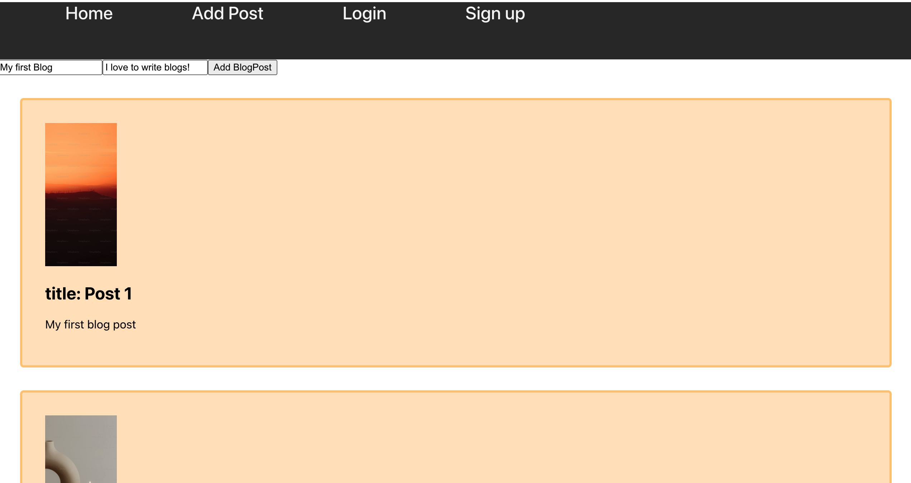

 My Blog App

 This is the front end for a full stack blog app with login.

 
 //we would put the actual link in here later//

 # Build Instructions
 1. git clone https://github.com/DebbieDavilaDev/frontend-blogapp
 2. cd c12-blogapp-fullstack-frontend
 3. npm i
 4. npm start

 ## Backend Repo
 [click here to view the backend](https://github.com/DebbieDavilaDev/backend-blogapp)